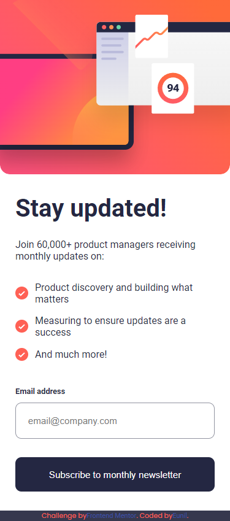

# newsletter

This is a solution to the [Newsletter sign-up form with success message challenge on Frontend Mentor](https://www.frontendmentor.io/challenges/newsletter-signup-form-with-success-message-3FC1AZbNrv). Frontend Mentor challenges help you improve your coding skills by building realistic projects. 

## Table of contents

- [Overview](#overview)
  - [Screenshot](#screenshot)
  - [Links](#links)
- [My process](#my-process)
  - [Built with](#built-with)
  - [What I learned](#what-i-learned)
  - [Continued development](#continued-development)

## Overview

### Screenshot

### Links

- Solution URL: [https://github.com/EunilCarl/newsletter](https://github.com/EunilCarl/newsletter)
- Live Site URL: [https://eunilcarl.github.io/newsletter/](https://eunilcarl.github.io/newsletter/)

  ### Built with

- Semantic HTML5 markup
- CSS custom properties
- Flexbox
- CSS Grid
- Mobile-first workflow

### What I learned

I learned some crazy ahh DOM manipulation

### Continued development

I will probably learn about api soon after this lol
